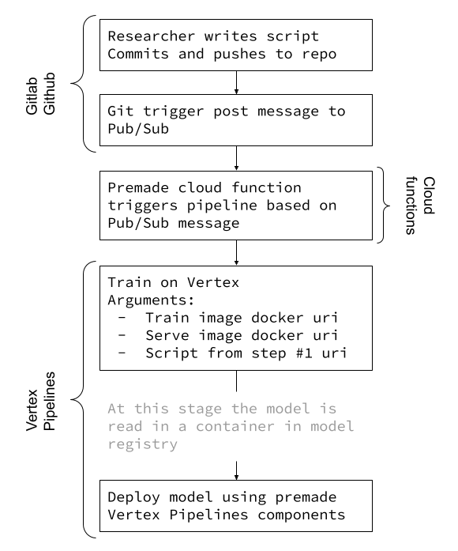

# From Script to training pipeline

A Github Workflow located at [.github/workflows/github-actions-demo.yml](https://github.com/jy2k/github-actions-test/tree/main/.github/workflows).

The Workflow:
1. Once a push is made to the repo the workflow triggers
2. The workflow sends a message to a pub/sub topic
3. Cloud Function trigger with base64 encoded JSON (see example pubsub-payload.json)
4. Cloud Function decodes message and starts pipelines
5. Pipeline trains a model

Important to configure your project to run with vertex pipelines - [some APIs need to be enabled](https://console.cloud.google.com/vertex-ai/locations/us-central1/pipelines/runs/hello-world-scheduled-pipeline-20211120225731?project=1065652454167)

This is a rough diagram of the end-to-end architecture:

[Here](https://cloud.google.com/vertex-ai/docs/pipelines/trigger-pubsub) is how to write a cloud function that picks up on a pub/sub message and triggers a pipeline.

## Optional
The message in pub/sub can trigger any precompiled pipeline.
Potentially you could start any piece of code in the cloud function - for example [here](https://github.com/jy2k/Kubeflow-v2-end-to-end) is an end-to-end pipeline that can be triggered.

### Secrets
The pub/sub topic, Service account (in base 64), and project id are defined as secrets in the repo
[Here](https://damienaicheh.github.io/github/actions/2021/04/15/environment-variables-secrets-github-actions-en.html) is how to create secrets in Github (also shows how to create convert key.json to base64)
[Here](https://medium.com/firebase-developers/create-automatic-firestore-backups-with-github-actions-abb12eef86a0) is how to save the service account JSON key in base64

### Service account
[Create a Service account](https://cloud.google.com/iam/docs/creating-managing-service-accounts#creating) in your Google Project and download a JSON key. Encode it as base65 and save it to the Repos secrets.
The minimum role that the service account needs is ["Pub/Sub Publisher"](https://cloud.google.com/iam/docs/understanding-roles#pub-sub-roles).

### Testing
Trigger a git commit and push
Publish a message through the pub/sub UI

Generally based the Github actions workflow on [this](https://github.com/google-github-actions/setup-gcloud) gcloud setup
